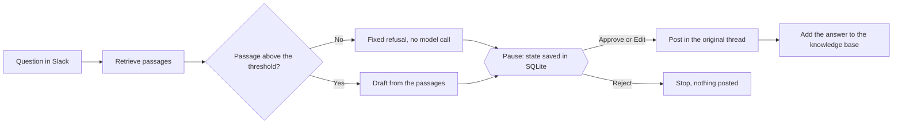

# FDE Support Copilot

A Slack bot that drafts answers to support questions from a small knowledge base. A reviewer approves, edits or rejects every draft, and nothing is posted in the support thread before that decision.

[](https://github.com/Nyamey/fde-support-copilot/actions/workflows/ci.yml)

Portfolio project by Karen Ekiyabe. Related projects: [ai-data-agent](https://github.com/Nyamey/ai-data-agent) and [opc-rpa-ia-reporting](https://github.com/Nyamey/opc-rpa-ia-reporting).

## What it does

1. **Listens** to one support inbox channel in Slack. Each new top-level message is a question.
2. **Retrieves** the five passages of the knowledge base closest to the question, and drops those below a relevance threshold.
3. **Drafts** an answer from the remaining passages only. If no passage is left, it skips the model and drafts a fixed refusal.
4. **Pauses** and posts the draft in a separate review channel, with the question, a confidence label, the source files and three buttons: Approve, Edit and Reject.
5. **Posts** the approved or edited answer as a reply in the original thread, and adds it to the knowledge base. A rejection ends the run and posts nothing.



The pause is a LangGraph `interrupt_before` on the `human_gate` step. The state of the run is saved in a SQLite checkpoint keyed by the Slack channel and the timestamp of the question, and a button click resumes that same run with `update_state` then `invoke(None)`. It is the pattern used in ai-data-agent, applied to a tool that other people can see.

## Why I built it

To practise three things my first project did not cover: an integration with an external tool through the Slack API, a Docker deployment on a cloud host, and a human approval step on a system that other people can see. I use AI coding assistants to move faster, and I stay responsible for the design choices, the tests and the validation.

## Evaluation

The [`evaluation/`](evaluation/) folder holds 40 questions: 30 that the docs answer, 3 of them in French, each with the file that should be retrieved and a key fact, plus 10 off-topic questions. `python -m evaluation.run_eval` rebuilds the knowledge base in a temporary database and runs every question through retrieval and drafting with the real models. Last run, on 30 September 2026, with `openrouter/openai/text-embedding-3-small` and `groq/openai/gpt-oss-120b`:

| Measure | Result |
|---|---|
| Right file among the 5 passages retrieved | 30/30 |
| Right file in first place | 30/30 |
| Answerable questions kept by the threshold | 30/30 |
| Off-topic questions refused before any model call | 10/10 |
| Off-topic questions refused by the model alone, threshold switched off | 10/10 |
| Answers containing the key fact, keyword check | 27/30 |
| Answers supported by the docs, every draft read by hand | 30/30 |
| Retrieval time per question, embedding call included | median 0.46 s, max 0.99 s |
| Drafting time per question | median 0.53 s, max 1.40 s |

The three keyword misses are correct paraphrases, for example "Slack's 3-second reply timeout" where the check looked for "3 seconds". Every draft is in [evaluation/results/drafts.md](evaluation/results/drafts.md), and the full tables are in [evaluation/results/summary.md](evaluation/results/summary.md).

**How the threshold was chosen.** The off-topic questions scored at most 0.28 against the knowledge base, and the answerable ones at least 0.39, the lowest being a French question against English docs. The default threshold, 0.33, sits in the middle of that gap. The summary shows the result of every candidate threshold from 0.20 to 0.60.

**What it does not show.** The questions were written with the docs in view, so they are easier than real ones, and the knowledge base is small: five files, 39 passages. The model's answers vary a little from one run to the next. The next step is a two-week pilot with a small team, on their public documentation and with their written agreement.

**What it changed in the code.** The first drafts contained non-breaking hyphens and narrow no-break spaces, for example inside the model name gpt-oss-120b. They look normal but break a command or a model name copied from the answer, so the bot now replaces them with plain characters.

## How the awkward cases are handled

| Case | What the bot does |
|---|---|
| The knowledge base does not cover the question | Passages below the threshold are dropped. With none left, the draft is a fixed refusal and the model is not called. When the model gets passages that do not cover the question, it replies with a `NO_ANSWER` marker, turned into the same refusal. |
| Slack sends the same event twice, which happens while the free instance wakes up | Runs are keyed by channel and message timestamp. A second delivery of a message already in progress or already drafted is skipped, so one question gives one review message. |
| Two reviewers click at the same time, or one reviewer clicks twice | The decision is recorded once, under a lock. Later clicks change nothing and get a private note. |
| The model provider is down, over quota or has retired the model | `SUPPORT_COPILOT_LLM_FALLBACKS` lists backup models tried in order. If every model fails, the review channel is told that no draft could be produced, with the question. |
| The service restarts while a question waits for review | The free plan has no persistent disk, so the paused run is lost. A click on it gets a private note asking the reviewer to answer by hand. |
| Someone edits a message or replies inside a thread | Ignored: only new top-level messages are questions. |

## Status, 30 September 2026

- The code, the 45 tests and the evaluation run locally, and the tests run in CI on every push.
- The Render service at https://fde-support-copilot.onrender.com/ answers its health check. After a sleep, the first request took 80 seconds.
- The Slack app is installed in a personal test workspace. Next steps: connect it to the Render service (environment variables on Render, Request URLs in the Slack app), then record a full run: question, draft, edit, approval and answer in the thread. Until then, the Slack loop is covered by tests that mock Slack, including two runs through the real graph and checkpoint.
- No company or customer uses the bot.

## Stack

- **LangGraph** for the steps, the pause and the SQLite checkpoint
- **Slack Bolt for Python**: Socket Mode for local development, HTTP mode with Flask and gunicorn on Render
- **DuckDB** to store the passages and their embeddings, with cosine similarity computed in NumPy. A full scan is enough for a few thousand passages, so there is no separate vector database.
- **LiteLLM** for the embedding and drafting calls, with a list of backup models
- **Docker**, on Render's free Web Service plan. Background workers, the natural fit for Socket Mode, start at 7 dollars a month.
- **pytest**, pytest-mock and GitHub Actions

## Tests

45 tests, 89% line coverage of `agent/`, `knowledge_base/` and `slack_app.py`. Slack, the models and the embedding API are replaced by test doubles, so the tests need no API key. They cover each agent step, the threshold, the backup models, the refusal marker, ingestion and search, the Slack handlers, the duplicate-event and double-click guards, and two runs through the real LangGraph graph with its SQLite checkpoint: one approved, one rejected.

```bash
pytest
```

## Project layout

```
fde-support-copilot/
├── agent/
│   ├── graph.py          # retrieve → draft → human_gate → post → log, paused before human_gate
│   ├── nodes.py          # the steps: threshold, drafting with backup models, refusal marker
│   └── state.py          # the shared state (Pydantic model)
├── knowledge_base/
│   ├── db.py             # DuckDB connection and LiteLLM embedding helper
│   ├── ingest.py         # cuts the docs into passages and stores their embeddings
│   └── retriever.py      # cosine-similarity search used by the retrieve step
├── docs/                 # the knowledge base: five Markdown files about the bot itself
├── evaluation/
│   ├── questions.csv     # 30 answerable and 10 off-topic questions
│   ├── run_eval.py       # rebuilds the knowledge base and runs every question
│   └── results/          # summary.md, drafts.md and results.csv of the last run
├── slack_app.py          # Slack events, review message, Approve / Edit / Reject handlers
├── tests/
├── slack-app-manifest.yml       # Slack app for local development (Socket Mode)
├── slack-app-manifest.http.yml  # Slack app for the Render deployment (HTTP mode)
├── Dockerfile
├── .github/workflows/ci.yml
├── requirements.txt
└── .env.example
```

## Running locally

```bash
cp .env.example .env        # Slack tokens, channel IDs, OpenRouter and Groq keys
pip install -r requirements.txt
python -m knowledge_base.ingest --source ./docs
python slack_app.py         # Socket Mode by default: no public URL needed
```

To run the evaluation, with `OPENROUTER_API_KEY` and `GROQ_API_KEY` set:

```bash
python -m evaluation.run_eval
```

## Deploying on Render

1. Create a Web Service from this repository. Render builds the Dockerfile, and the container rebuilds the knowledge base from `docs/` when it starts.
2. Set the variables of `.env.example` in the Render dashboard, with `SLACK_MODE=http`. `SLACK_APP_TOKEN` is not needed in HTTP mode.
3. Wake the service by opening its root URL, then update the Slack app at api.slack.com/apps with `slack-app-manifest.http.yml`. It turns Socket Mode off and sends events and button clicks to `https://fde-support-copilot.onrender.com/slack/events`. Slack checks that URL when you save.
4. Reinstall the app if Slack asks, and invite the bot to both channels.

## Limits

- On the free plan, the service sleeps after 15 minutes without traffic, the first question after a sleep waits for the start, and pending reviews and newly added answers are lost when it restarts.
- One workspace and one public inbox channel. A private inbox would need the `groups:history` scope and the `message.groups` event.
- Follow-up questions posted inside a thread are not picked up.
- The confidence label measures how close the best passage is to the question, not whether the answer is right.

## Licence

MIT
